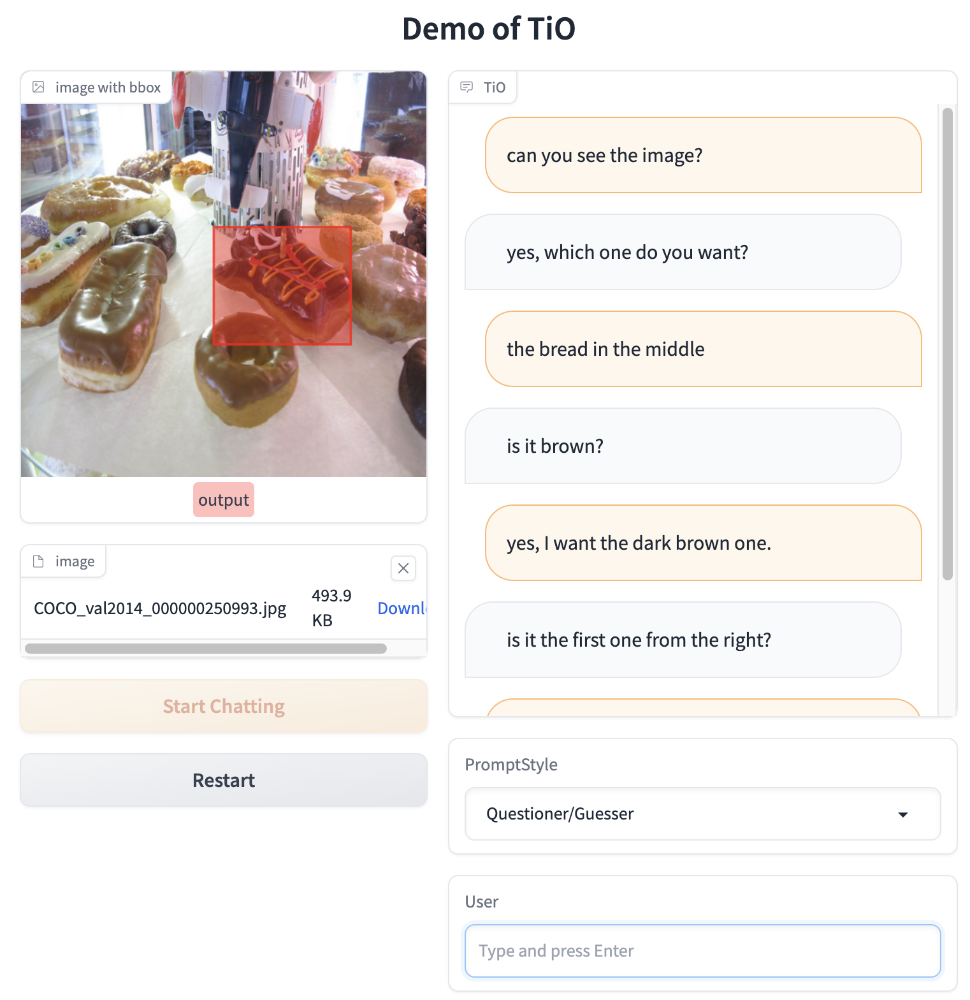
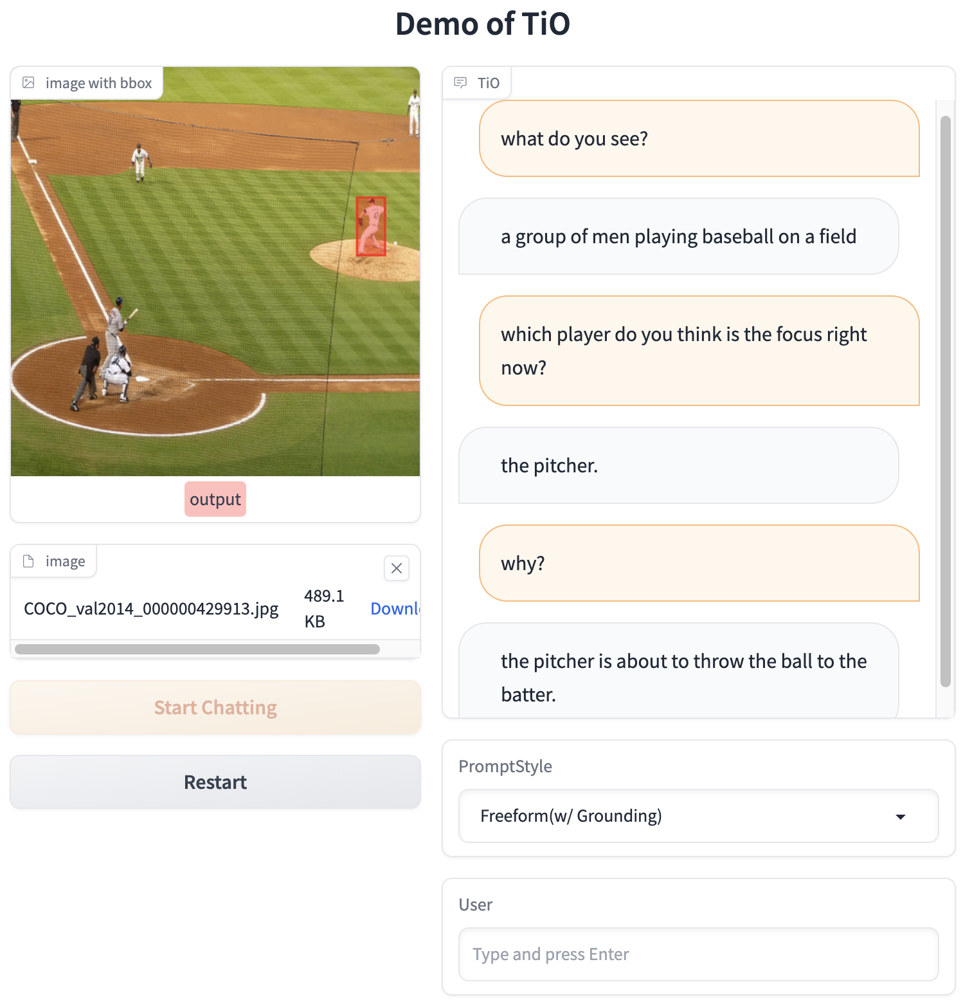

# TiO

We formulate a novel paradigm that applies a single model to play all three agents, and accordingly propose a unified visual dialog and grounding transformer. We perform extensive experiments on interactive visual grounding datasets GuessWhat?! and InViG to validate the superiority of the proposed paradigm, which achieves new state-of-the art performance and makes significant progress in the quality of generated dialog. 

## Quickstart
A step-by-step tutorial on how to configure the runtime environment and start our demo app.

### Prepare environments
- System Memory >= 20GB
- GPU Memory >= 10GB
- torch >= 1.10.0, cuda >= 11.3

(Develoment on torch 1.10.0, cuda 11.3)


```
# one-click-install.sh

# 1 apt install *
apt-get update
apt-get install -yq --no-install-recommends $(awk '{print $1'} packages.txt | tr "\n" " ")

# 2 pip install
python3 -m pip install -r requirements.txt

# 3 start!
python3 app.py --share
```
After waiting for ~100s, you'll see "`Running on local URL:  http://0.0.0.0:7860`".

> Optional: Check `config/invig_env.yml#L3` for ofa details.
> Optional: Check `app.py#L39` for checkpoint details.

### Step 2: Open your browser and enjoy.

> http://127.0.0.1:7860/

For the detail description, please refer to the chapter of `UI Interface`.


## UI Interface

The first step is to enter your fav picture, several samples have been prepared, which can be found in `attachments/examples`. Then let's click `Upload & Start Chat`.

We recommend that you first try to select `PromptStyle` as `Questioner/Guesser`. In this way, the goal of TiO is to try to figure out which entity you are talking about. And that's what we're really focused on in our work.



Of course, you might also want to use it as a chatbot, you can set `PromptStyle` to `Freeform` or `Freeform (w/Grounding)`.

You can talk to it the way you like. When `PromptStyle` is `Freeform`, you can test the visual dialog grounding ability by asking `which region?`. When `PromptStyle` is `Freeform (w/Grounding)`, TiO will ALWAYS give a bbox based on your dialogue history.





Finally, if you want to change an image and start a new conversation, just click `Restart` and upload a new image. Of course, you can refresh the website directly as well.

## Training


### Step 1: Prepare datasets.

- Prepare `invig`, `guesswhat`, `visdial`, ... datasets. (One-click Completion will be released in the future.)
- Prepare images, including `coco`, `visdial`, `openimages`, `sbu subset`, `cc3m subset`.

> Optional: Check `config/invig_env.yml` for detail.


### Step 2: Prepare pretrain checkpoints.

Put `pretrain.pt` into `./attachements` floder.

> Optional: Check `run_scripts/train_invig_huge.sh#L11` for detail.


### Step 3: Start Training!

Since the processed dataset is not suitable for anonymous uploading, the files will be released later.

```bash
sh run_scripts/train_invig_huge.sh
```

## Evalution

Since the processed dataset is not suitable for anonymous uploading, the files will be released later.

```python
python3 benchmark/get_score.py --file attachments/result_logs/tio-end2end.jsonl
```

> Optional: Check `benchmark/bench_datasets.py` for detail.

## Evalution Logs

- [tio-gt-grounding.jsonl](attachments/result_logs/tio-gt-grounding.jsonl)
- [tio-end2end.jsonl](attachments/result_logs/tio-end2end.jsonl)


